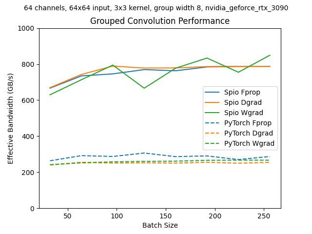
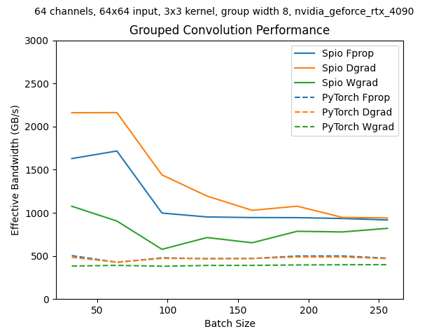

# Spio

High-performance CUDA kernels for training convolutional neural networks with PyTorch.



## Overview

Spio is a framework for developing and deploying efficient GPU kernels for deep learning. While ConvNet model architectures have evolved rapidly, kernel implementations have lagged behind, creating a gap between theoretical and sustained performance. Poor GPU kernels mean that practical performance falls far short of the theoretical roofline implied by model architectures, shifting the accuracy versus attainable latency curve to a much worse accuracy versus sustained latency curve. Spio bridges this efficiency gap by providing tools to create kernels that approach theoretical hardware limits.

Our initial focus is grouped convolution with group width 8 and stride 1, a promising operation that has fallen into disuse due to inefficient implementations. Spio's grouped convolution kernels achieve near-optimal memory bandwidth utilization on NVIDIA Ampere and Ada GPUs.

## Key Features

### 🔧 Typed Dimension System
Spio extends the "Named Tensors" approach to use compile-time type-checking for dimension consistency. Each dimension type identifies a unique logical dimension that can be used across multiple tensors. When the same dimension type appears in different tensors, it represents the same logical dimension, while each tensor defines its own size and stride for that dimension based on its layout.

This eliminates common indexing errors and makes kernel code more readable and maintainable through **operator overloading on dimension types** that enables **index-position free** indexing where users don't need to track dimension index positions, sizes, or strides across different tensors.

### ⚡ Just-in-Time Kernel Generation
Kernels are compiled at runtime using NVIDIA's libnvrtc, automatically optimized for your specific GPU architecture. No CUDA toolkit installation required - Spio uses the same NVIDIA libraries that PyTorch already depends on.

### 🎯 Performance Models
Machine learning models predict optimal kernel configurations based on layer parameters and hardware characteristics. This eliminates expensive auto-tuning while achieving better performance than heuristic-based approaches.

### 🚀 PyTorch Integration
Seamless integration with PyTorch through custom operators and torch.compile support. Drop-in replacement for existing operations with significant speedups.

## Performance Results

### Algorithm Innovation

The cuDNN Conv2d kernels use "implicit GEMM" with 1D horizontal tiling, causing excessive memory traffic due to overlapping reads in the convolution halo. Spio uses 2D tiling with a circular buffer overlap-add algorithm that:

- Reduces tile overlap and global memory traffic
- Maximizes register usage through loop unrolling
- Increases occupancy by minimizing local memory footprint
- Leverages tensor cores with 8x8 matrix operations for group width 8

### Benchmark Results

On NVIDIA RTX 3090, Spio approaches theoretical DRAM bandwidth limits for forward pass (FProp), input gradients (DGrad), and weight gradients (WGrad), while PyTorch/cuDNN implementations suffer from excess data transfers.

On NVIDIA RTX 4090, Spio exceeds DRAM bandwidth limits for small batch sizes by effectively utilizing the 72MB L2 cache:



Benchmarks use realistic workloads with layers embedded in ConvFirst or MBConv blocks to accurately reflect real-world performance.

## Quick Start

### Installation

```bash
# Install system dependencies (Ubuntu)
sudo apt update && sudo apt install build-essential

# Clone and install
git clone https://github.com/andravin/spio.git
cd spio
pip install .

# Run tests (optional)
cd tests
SPIO_WORKERS=$(nproc) pytest .
```

### Usage

```python
import torch
import spio

# Replace PyTorch grouped convolution
x = torch.randn(32, 64, 56, 56, device='cuda', dtype=torch.float16)
weight = torch.randn(64, 8, 3, 3, device='cuda', dtype=torch.float16)

# Automatic kernel selection and compilation
output = spio.grouped_conv2d(x, weight, groups=8)
```

## Architecture Details

### Typed Tensors

Spio's typed tensor system extends the "Named Tensors" approach to use compile-time type-checking for dimension consistency. Each dimension type identifies a unique logical dimension that can be used across multiple tensors. When the same dimension type appears in different tensors, it represents the same logical dimension, while each tensor defines its own size and stride for that dimension based on its layout. This enables **index-position free** indexing where users don't need to track dimension index positions, sizes, or strides across different tensors.

Define tensor layouts for a matrix multiply kernel in the Python generator:

```python
# Dimension 'i' represents the same logical dimension across all tensors
# But each tensor defines its own size and stride for 'i' based on its layout
tensor_a = gen.Tensor(
    "A", gen.dtype.uint4, 
    # Dimension 'i' is at position 1 with size m
    gen.Dims(k16=k16, i=m, k8=2),
    constant=True
)
smem_tensor_a = gen.Tensor(
    "SmemA", gen.dtype.uint4,
    # Fold dimension 'i' with stride 16 at position 2 with size block_x16
    gen.Dims(ping=2, k16=config.chunk_k16, i16=block_x16, checkers=32)  
)
tensor_c = gen.Tensor(
    "C", gen.dtype.uint4,
    # Dimension 'i' is at position 0 with size m 
    gen.Dims(i=m, j8=n8)
)

# Define additional tensors for the CUDA kernel...
```

Define thread-block tiles in Python:
```python
# Dimension 'block_i' folds dimension 'i' with stride block_x.
gen.Fold("block_i", "i", block_x),

# Dimension 'block_j' folds dimension 'j' with stride block_x.
gen.Fold("block_j", "j", block_x),
```

In traditional CUDA code, you manually track array indices and remember that `A[k][i][k8]` corresponds to `C[i][j8]`. With Spio's operator overloading, the same dimension type automatically maps to the correct position and stride in each tensor:

```c++
// Dimension 'i' and folds 'block_i' and 'block_j' generate types I, BLOCK_I, and BLOCK_J
// that you use in the CUDA kernel.

// Map thread-block coordinates to blocks of I and J.
BLOCK_I block_i(blockIdx.y);
auto global_i = block_i.unfold() + global_load_idx.get<X>().cast<I>();

// Same 'i' dimension type works correctly across different tensors
// - In tensor A: 'i' maps to position 1 with A's stride for dimension 1
// - In tensor C: 'i' maps to position 0 with C's stride for dimension 0
auto a_element = A(a_ptr)[global_i][global_load_idx.get<K8>()];  
auto c_element = C(c_ptr)[global_i];                            

// The user doesn't track positions, sizes, or strides - the type system handles it all
// Type safety prevents dimension misuse at compile time
// auto wrong = smem_a[compute_idx.get<WARP_J>()];  // Compile error: WARP_J not valid for SmemA
```

The main computation loop demonstrates how typed dimensions provide compile-time safety by preventing incompatible dimension types from being used with tensors that don't support them. The tensor implementations use `constexpr` with known tile sizes so that tensor indexing arithmetic is greatly simplified at compile-time and loops with constant bounds are unrolled. This produces highly optimized code that runs at near full utilization on NVIDIA Ada GeForce RTX 4090 GPUs:

```c++
// Main computation loop with pipelined memory operations
for (int iter = 0; iter < size.get(); iter += 2 * step_size.get())
{
    // Double-buffer loads and compute.
    for (auto phase : range(PING(2)))
    {
        // If not the last iteration, load the next tile from global
        // memory to shared memory asynchronously.
        if (iter + (phase.get() + 1) * step_size.get() < size.get())
        {
            // Load into the back-buffer.
            loader_a.load(smem_a_store[(phase + 1) % 2].get(), a.get());
            loader_b.load(smem_b_store[(phase + 1) % 2].get(), b.get());
        }

        // Advance the global memory tiles.
        a.step(step_size); 
        b.step(step_size);

        // Synchronize on the previous iteration's global memory load.
        __pipeline_commit();
        __pipeline_wait_prior(1);
        __syncthreads();

        // Load matrix tiles from shared memory.
        a_tile.load(smem_a_load[phase]);
        b_tile.load(smem_b_load[phase]);

        // Matrix-multiply the tiles using tensor cores.
        // Compile-time type checking ensures the compatibility of the tile dimensions.
        mma(a_tile, b_tile, c_tile, c_tile);
        __syncthreads();
    }
}
```

The output staging loop demonstrates how dimensions can be dynamically refolded with different strides, while the type system ensures compile-time safety by preventing incompatible fold operations:

```c++
// Nested loops using typed dimension iterators - no manual index calculations
for (auto i16 : range(c_tile.size<I16>())) {
    for (auto j16 : range(c_tile.size<J16>())) {
        *smem_c_cursor[j16.fold<8>()][i16] = c_tile[i16][j16]->to_half2(f);
    }
}
```

The system automatically handles:
- **Logical dimension consistency**: Same dimension type represents the same logical dimension across all tensors
- **Automatic position mapping**: Operator overloading maps dimension types to correct array positions
- **Per-tensor size and stride**: Each tensor defines its own size and stride for shared dimensions
- **Index-position free operations**: No need to track array positions, sizes, or strides manually
- **Type safety**: Prevents using wrong dimension types at compile time
- **Memory layout optimization**: Automatic padding and alignment

### GPU Support

- **NVIDIA Ampere**: sm_80 (A100), sm_86 (RTX 30-series)
- **NVIDIA Ada**: sm_89 (RTX 40-series)
