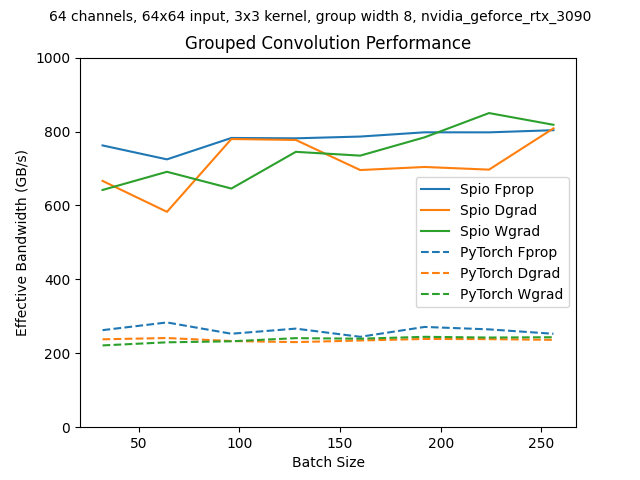
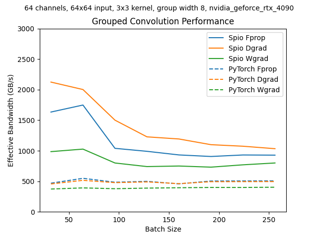

# Spio

Efficient CUDA kernels for training convolutional neural networks with PyTorch.

## Introduction

The goal of the Spio project is to improve the training efficiency of convolutional neural networks.
While there has been a lot of progress in the design of convnet models,
the performance of convnet kernels has languished. Today, the performance of a convnet is often limited by the efficiency of its implementation.

In our [paper](https://arxiv.org/abs/2404.03617), we implemented efficient GPU kernels for convnet inference.
This project implements kernels for training.

The first Spio kernel is for grouped convolution, a prime example of a promising layer that has fallen into disuse because of the inefficiency of the current implementation. We focus on group-width equal to eight and stride 1, as used in our ConvFirst model.

## Benchmarks

The cuDNN conv2d kernels use an "implicit gemm" algorithm that tiles the input tensor with horizontal strips. The support halo for the convolution kernel causes overlapping reads of the input tensor, and when the tile is a 1-D strip, the overlap is larger than the tile. This results in excess global memory traffic.

The Spio conv2d kernel used 2-d tiles. This
reduces the overlap between tiles and reduces global memory traffic.

On the NVIDIA RTX 3090 GPU, Spio approaches the DRAM memory bandwidth limit for the Fprop, Dgrad (gradient with respect to inputs), and Wgrad (gradient with respect to weights) kernels, while the PyTorch / cuDNN kernels struggle with excess data transfers:



On the NVIDIA RTX 4090 GPU, Spio exceeds the DRAM memory bandwidth limit for small batch sizes by exploiting the fact that the activation tensors fit in the GPU's large (72 MB) L2 cache:



### Benchmarking Methodology

Our benchmarks use [torch.profile](https://pytorch.org/docs/stable/profiler.html), which uses NVIDIA's [libcupti](https://developer.nvidia.com/cupti-ctk12_0) internally for precise
kernel timing. We benchmark layers *in situ*, placing a grouped convolution layer inside a
ConvFirst or MBConv building block and constructing a stack of several blocks. This creates a realistic environment for the target kernel, where the memory hierarchy is exercised similarly to a real-world use case.

## Installation from Source

First, ensure you have a C compiler installed. On Ubuntu:

```bash
sudo apt update
sudo apt install build-essential
```

Clone the repository:

```bash
git clone https://github.com/andravin/spio.git
cd spio
```

Optionally, create a virtual environment and activate it:

```bash
python -m venv .venv
source .venv/bin/activate
```

Install the package from source using pip:

```bash
pip install --upgrade pip
pip install .
```

Optionally, run the unit tests. This can take a while,
because Spio tests every configuration of each kernel. It goes a bit faster
if we set the SPIO_WORKERS environment variable to use all CPU cores for compiling kernels:

```bash
cd tests
SPIO_WORKERS=$(nproc) pytest .
```

Note: the tests and scripts cannot be run from the top-level spio directory because
that would cause Python to find the local spio package instead of the installed package.
Only the installed package includes the compiled spio.cuda.driver Cython extension, so using
the local package would result in an import error. Therefore, running `cd tests` before `pytest .` is essential.

## Using Spio with Timm

Spio is integrated with [our fork](https://github.com/andravin/pytorch-image-models.git) of pytorch-image-models (timm) on the `spio_dev` branch. Add the `--spio` option to the command line of `benchmark.py`, `validate.py`, or `train.py`, and timm will use the Spio implementation for any supported operations.
